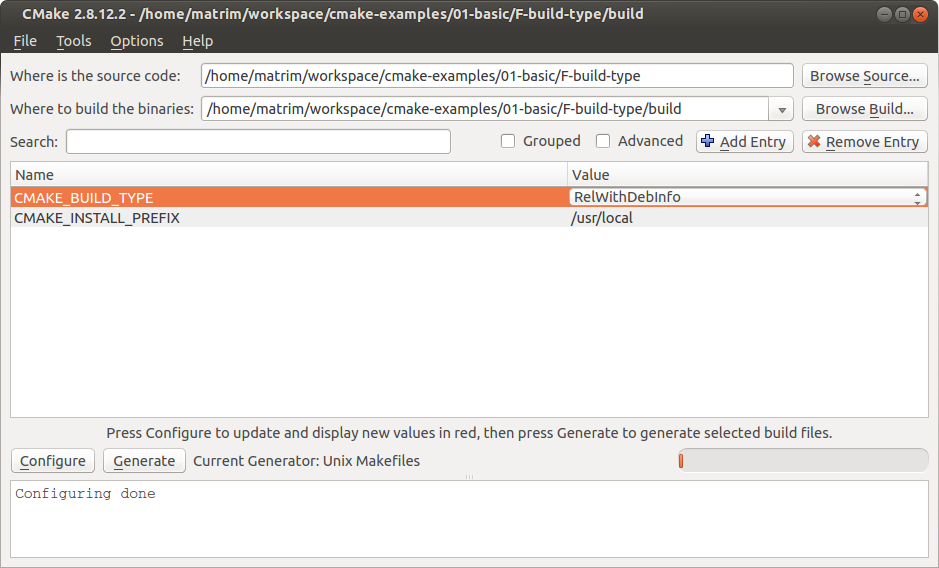
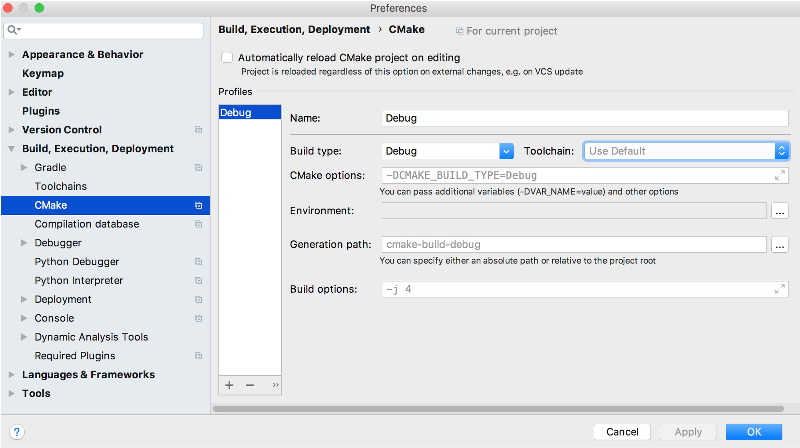

# Build Type

- [Introduction](#Introduction)
- [Concepts](#Concepts)

# Introduction

CMake has a number of built in build configurations which can be used to compile
your project. These specify the optimization levels and if debug information is
to be included in the binary.

The levels provided are:

  * Release - Adds the `-O3 -DNDEBUG` flags to the compiler
  * Debug - Adds the `-g` flag
  * MinSizeRel - Adds `-Os -DNDEBUG`
  * RelWithDebInfo - Adds `-O2 -g -DNDEBUG` flags

The files in this tutorial are below:

```
$ tree
.
├── CMakeLists.txt
├── main.cpp
```

  * [CMakeLists.txt](CMakeLists.txt) - Contains the CMake commands you wish to run
  * [main.cpp](main.cpp) - The source file with main

# Concepts

## Set Build Type

The build type can be set using the following methods.

  - Using a gui tool such as ccmake / cmake-gui



  - Passing into cmake

````
cmake .. -DCMAKE_BUILD_TYPE=Release
````

  - Using [CLion](https://www.jetbrains.com/help/clion/configuring-cmake.html)
  


## Set Default Build Type

The default build type provided by CMake is to include no compiler flags for
optimization. For some projects you may want to
set a default build type so that you do not have to remember to set it.

To do this you can add the following to your top level CMakeLists.txt

```
if(NOT CMAKE_BUILD_TYPE AND NOT CMAKE_CONFIGURATION_TYPES)
  message("Setting build type to 'RelWithDebInfo' as none was specified.")
  set(CMAKE_BUILD_TYPE RelWithDebInfo CACHE STRING "Choose the type of build." FORCE)
  # Set the possible values of build type for cmake-gui
  set_property(CACHE CMAKE_BUILD_TYPE PROPERTY STRINGS "Debug" "Release"
    "MinSizeRel" "RelWithDebInfo")
endif()
```

# Building the Example

````
$ mkdir build

$ cd build/

$ cmake ..
Setting build type to 'RelWithDebInfo' as none was specified.
-- The C compiler identification is GNU 4.8.4
-- The CXX compiler identification is GNU 4.8.4
-- Check for working C compiler: /usr/bin/cc
-- Check for working C compiler: /usr/bin/cc -- works
-- Detecting C compiler ABI info
-- Detecting C compiler ABI info - done
-- Check for working CXX compiler: /usr/bin/c++
-- Check for working CXX compiler: /usr/bin/c++ -- works
-- Detecting CXX compiler ABI info
-- Detecting CXX compiler ABI info - done
-- Configuring done
-- Generating done
-- Build files have been written to: cmake-examples/06-build-type/build

$ make VERBOSE=1
$ cd build/
/build$ cmake ..
Setting build type to 'RelWithDebInfo' as none was specified.
-- The C compiler identification is GNU xxx
-- The CXX compiler identification is GNU xxx
-- Check for working C compiler: /usr/bin/cc
-- Check for working C compiler: /usr/bin/cc -- works
-- Detecting C compiler ABI info
-- Detecting C compiler ABI info - done
-- Check for working CXX compiler: /usr/bin/c++
-- Check for working CXX compiler: /usr/bin/c++ -- works
-- Detecting CXX compiler ABI info
-- Detecting CXX compiler ABI info - done
-- Configuring done
-- Generating done
-- Build files have been written to: cmake-examples/06-build-type/build
/build$ make VERBOSE=1
````
