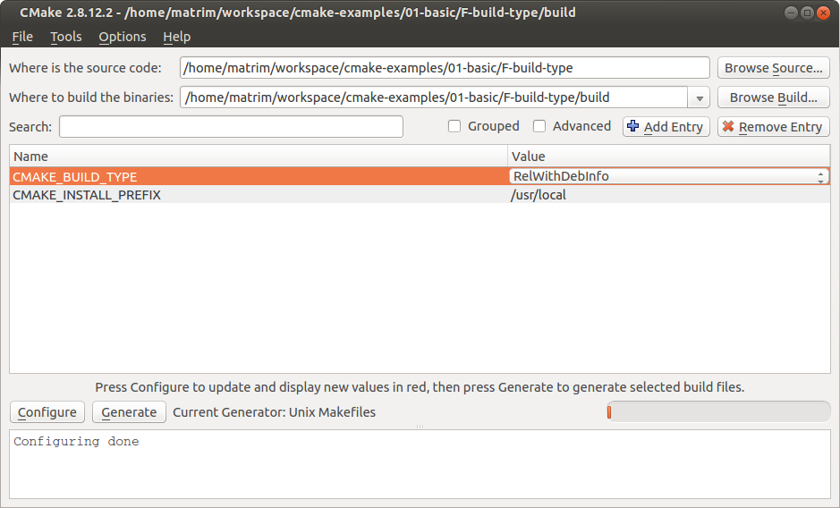

# Compile Flags

- [Introduction](#Introduction)
- [Concepts](#Concepts)

# Introduction

CMake supports setting compile flags in a number of different ways:

  * using **target_compile_definitions()** function
  * using the **CMAKE_C_FLAGS** and **CMAKE_CXX_FLAGS** variables.

The files in this tutorial are below:

```
$ tree
.
├── CMakeLists.txt
├── main.cpp
```

  * [CMakeLists.txt](CMakeLists.txt) - Contains the CMake commands you wish to run
  * [main.cpp](main.cpp) - The source file with main

# Concepts

# Set Per-Target C++ Flags

The recommended way to set C++ flags in modern CMake is to use per-target flags which can be populated to other targets
through the **target_compile_definitions()** [function](https://cmake.org/cmake/help/v3.12/command/target_compile_definitions.html?highlight=target_compile_definitions). 
This will populate the [INTERFACE_COMPILE_DEFINITIONS](https://cmake.org/cmake/help/v3.12/prop_tgt/INTERFACE_COMPILE_DEFINITIONS.html#prop_tgt:INTERFACE_COMPILE_DEFINITIONS) for the library and push the definition to the linked target depending on the scope.

````
target_compile_definitions(cmake_examples_compile_flags
    PRIVATE EX3
)
````

This will cause the compiler to add the definition **-DEX3** when compiling the target.

In the target was a library, and the scope **PUBLIC** or **INTERFACE** has been chosen the definition would also be included in any executables that link this target.

For compiler options you can also use the **target_compile_options()** [function](https://cmake.org/cmake/help/v3.12/command/target_compile_options.html).

## Set Default C++ Flags

The default `CMAKE_CXX_FLAGS` is either empty or contains the appropriate flags
for the build type.

To set additional default compile flags you can add the following to your
top level CMakeLists.txt

````
set (CMAKE_CXX_FLAGS "${CMAKE_CXX_FLAGS} -DEX2" CACHE STRING "Set C++ Compiler Flags" FORCE)
````

Similarly to **CMAKE_CXX_FLAGS** other options include:

  * Setting C compiler flags using **CMAKE_C_FLAGS**.
  * Setting linker flags using **CMAKE_LINKER_FLAGS**.
  
To set global linker flags for all targets in our projects:
````
set(CMAKE_EXE_LINKER_FLAGS "xxx")
set(CMAKE_EXE_LINKER_FLAGS_DEBUG "xxx")     
set(CMAKE_EXE_LINKER_FLAGS_RELEASE "<flags here>") 
````
If we want to set the linker flags for just one target, then we can use **[set_target_properties](https://cmake.org/cmake/help/v3.12/command/set_target_properties.html)**
````
set_target_properties(my_target PROPERTIES LINK_FLAGS "<flags here>")
set_target_properties(my_target PROPERTIES LINK_FLAGS_DEBUG "<flags here>")
set_target_properties(my_target PROPERTIES LINK_FLAGS_RELEASE "<flags here>")
````

**NOTE**
````
The values `CACHE STRING "Set C++ Compiler Flags" FORCE` from the above command
are used to force this variable to be set in the CMakeCache.txt file.
````

For more details, see [here](https://cmake.org/cmake/help/v3.12/command/set.html).

Once set the **CMAKE_C_FLAGS** and **CMAKE_CXX_FLAGS** will set a compiler flag / definition globally for all targets in this directory or any included sub-directories. This method is not recommended for general usage now and the **target_compile_definitions** function is preferred.

### Set CMake Flags

Similar to the build type a global C++ compiler flag can be set using the following methods.

  - Using a gui tool such as ccmake / cmake-gui



  - Passing into cmake

````
cmake .. -DCMAKE_BUILD_TYPE=Release
````

  - Using [CLion](https://www.jetbrains.com/help/clion/configuring-cmake.html)
  


````
cmake .. -DCMAKE_CXX_FLAGS="-DEX3"
````

# Building the Example

````
$ mkdir build

$ cd build/

$ cmake ..
-- The C compiler identification is GNU xxx
-- The CXX compiler identification is GNU xxx
-- Check for working C compiler: /usr/bin/cc
-- Check for working C compiler: /usr/bin/cc -- works
-- Detecting C compiler ABI info
-- Detecting C compiler ABI info - done
-- Check for working CXX compiler: /usr/bin/c++
-- Check for working CXX compiler: /usr/bin/c++ -- works
-- Detecting CXX compiler ABI info
-- Detecting CXX compiler ABI info - done
-- Configuring done
-- Generating done
-- Build files have been written to: cmake-examples/07-compile-flags/build

$ make VERBOSE=1
````
